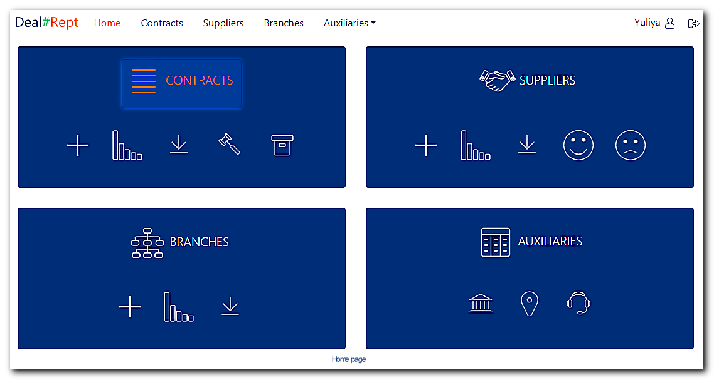

# Deal#Rept
Simple and scalable enterprise web application to store and access data about concluded contracts and party involved.
Live demo [_here_](http://yuliyapog-001-site1.atempurl.com/)

## Table of Contents
* [General Info](#general-information)
* [Technologies Used](#technologies-used)
* [Features](#features)
* [Project Status](#project-status)
* [Room for Improvement](#room-for-improvement)
* [Acknowledgements](#acknowledgements)
* [Contact](#contact)
  

## General Information
Deal#Rept was created for demonstration purpose.

### Problem To Solve
StateCompany is a fictional state domestic company with some state mission and a wast grid of branches all over the country. To maintain their activity branches conclude contracts with suppliers on behalf of StateCompany, these contracts are processed and followed by the staff of a Contract department in the head office of StateCompany. For example, when one of the branches needs fuel, it’s staff should conclude contract with a fuel supplier on behalf of StateCompany and transfer the contract to the Contract department in the head office. The staff of the Contract department proceed all next necessary actions. However the staff of branches need to view data about suppliers and contracts and to create operational reports in .xlsx format. Furthermore, Managerial staff off the StateCompany head office need access to contract data with an opportunity to filter and sort it. So, with this in mind, **StateCompany needs a solution that allows to store data in one place and access it from different places with different permissions**: the Contract department staff in the head office should have permissions to add, edit, delete information and upload PDF copies of contract documents; managerial and branch staff should have permissions only to view data and download document copies and reports.

## Technologies Used
- [ASP.NET MVC Core 3.1](https://learn.microsoft.com/en-us/aspnet/core/introduction-to-aspnet-core?view=aspnetcore-3.1)
- [Entity Framework Core 5.0](https://learn.microsoft.com/en-us/ef/core/)
- [ASP.NET Identity Core 3.1](https://learn.microsoft.com/en-us/aspnet/core/security/?view=aspnetcore-3.1)
- [MySQL Server 8.0](https://dev.mysql.com/doc/refman/8.0/en/)
- [Bootstrap 4.1](https://getbootstrap.com/docs/4.1/getting-started/introduction/)
- [AutoMapper 12.0](https://automapper.org/)
- [ClosedXML 0.100](https://github.com/ClosedXML/ClosedXML)
- [SeriLog.AspNetCore 6.1](https://github.com/serilog/serilog-aspnetcore)
- [jQuery Plugin: Are-You-Sure (Dirty Form Detection)](https://github.com/codedance/jquery.AreYouSure/)
- [Collection of free vector icons Friconix](https://friconix.com/)
- [ASP.NET Core Web Optimizer 3.0.384](https://github.com/ligershark/WebOptimizer)
- [Chart.js 4.4.0](https://www.chartjs.org/)
- [Select2 4.1.0](https://select2.org/)
- [FullCalender 6.1.10](https://fullcalendar.io/)

## Features
### User Identification & Authorization
- user registration: to access pages other than Dashboard user should register, confirm his/her email and be approved and role assigned by an administrator;
- after email confirmation user has ability to view own profile information, reset and change password in case he/she forgot it;
- Deal#Rept has an embedded user with root administrator role which can not be deleted or edited, if needed another user can be assigned an administrator role (further user with administrator role are named administrator);
- administrator checks, approves new user, assigns appropriate role (permissions), also has ability to view, edit detailed user profile information, delete, lockout, unlock or suspend the user temporarily;
- Deal#Rept has four permission levels through a role assignment, one user can be assigned several roles (except JustRegistered or Suspended):

| Level | Role names | Permissions|
| --- | --- | --- |
| 1 | JustRegistered, Suspended | only to view Dashboard and profile information pages |
| 2 | BranchStaff | only to view contract/supplier/branch data, download reports to .xlsx file, view and download PDF copies of contract documents |
| 3 | ContractStaff | to view, add, edit, delete contract/supplier/branch data, upload, view, download PDF copies of contract documents and download reports to .xlsx file |
| 4 | Administrator | to approve user, assign roles, delete user, view and edit detailed user profile information, lockout and unlock user |

### Data storage
- separate storage (database) of users credentials;
- centralized storage (database) of data about concluded contracts, suppliers, branches and another connected data;
- ability to create regular backups of storing data;
- centralized repository for PDF copies of contract documents with a “Recycle Bin” for deleted documents;
- database design defines separate tables for current type (status-current) and past type (statuses: fulfilled, terminated and invalid) contracts, it increases performance by reducing the data array to work with.

### Data access
#### Deal#Rept provides abilities:
- to view data about contract/supplier/branch/bank/city; 
- to filter and sort data by contract/supplier/branch/bank/city properties:

| Entity | Filter property | Sort property|
| --- | --- | --- |
| Contract | Contract number, contract amount, contract conclusion and expiration date spans, supplier name or legal code, branch name or code, past contract status, is there contract litigation (court disputes) |conclusion date, contract amount, supplier name, branch name |
| Supplier | Supplier name or legal code, supplier specialization, legal address, is there any negative remarks about the supplier | Supplier name, supplier specialization, legal address |
| Branch | Branch name or code, postal address, head’s full name | Branch name, postal address, head’s full name |
| Bank | Bank name or code | Bank name |
| City | City name | City name |
| User *(only for administrator role)* | Employee number, user full name, registration date, role, status of user account approval | Registration date, user full name, employee number |

- to create and download reports as XLSX files from filtered contract/supplier/branch/bank/city data;
- to print contract/supplier/branch brief information, including in PDF format;
- to upload, view and download PDF copies of contract documents;
- to notify when contract expiration date is earlier than today's date and there is no contract litigation so a user should consider changing contract status from current to one of the past types: fulfilled, terminated or invalid.

### Data manipulation
#### Deal#Rept provides abilities:
- to add, edit and delete current contract/supplier/branch/bank/city data through respective pages;
- to add related contracts through supplier and branch pages;
- to add related suppliers and branches through bank and city pages;
- to import (insert) cities and banks from .xlsx file;
- to transfer contract from current type to past by changing contract status from current to one of the past types: fulfilled, terminated or invalid;
- to check and notify about form changes when adding and editing data, this protects from losing unsaved data;
- to validate data when adding or editing data by user (on the client and server sides), this protects a database integrity.

#### Deal#Rept restricts: 
- from past contract data editing/deleting;
- from current contract data deleting if it has uploaded documents;
- from uploaded contract documents physical deleting (only marked as deleted);
- from supplier/branch/bank/city data deleting if they have related contracts, suppliers or branches.
These restrictions protect a database integrity.

### Data visualization
#### Deal#Rept provides abilities:
- to display bar charts with monthly data on the quantity and amount of concluded contracts for the last 3, 6 or 12 months, you can see it [here](http://yuliyapog-001-site1.atempurl.com/Contracts/ShowCharts);
- to display doughnut charts with suppliers quantity by the quantity and amount of contracts they have concluded, you can see it [here](http://yuliyapog-001-site1.atempurl.com/Suppliers/ShowCharts);
- to display polararea charts with branches quantity by the quantity and amount of contracts they have concluded, you can see it [here](http://yuliyapog-001-site1.atempurl.com/Branches/ShowCharts);.

### Email Service (through gmail.com SMTP server)
#### Deal#Rept sends messages automatically:
- to user email about account registration and a password resetting progress;
- to administrator email addresses about new user to approve;
- to related branches about contract status changes: adding, deleting and transferring to past type.
  
#### Deal#Rept provides abilities to send email messages with attachments by filling out the form:
- from user to administrator;
- from administrator to users of specific roles or/and employee numbers.

### Calendar
#### Deal#Rept provides abilities:
- to view current and past contract events;
- to add, edit and delete current contract events.

### Responsive design
- flexible grid depending on screen size;
- disabled tooltips and enabled buttons with shadow on devices with a touch screen.

## Project status
Deal#Rept is still in progress.

## Room for improvement
### Deal#Rept abilities (areas) for future development:
- repository for supplier documents PDF copies;
- etc.

## Acknowledgements
### To create Deal#Rept the following tutorials were used:
- [Microsoft Documentation ASP.NET Core MVC with EF Core—tutorial series](https://learn.microsoft.com/en-us/aspnet/core/data/ef-mvc/?view=aspnetcore-3.1);
- [ASP.NET Core Identity Series](https://code-maze.com/asp-net-core-identity-series/);
- [How to Send an Email in ASP.NET Core](https://code-maze.com/aspnetcore-send-email/).

Many thanks to their authors!

## Contact
Created by Yuliya Pogoryelova—feel free to contact me! 

pogoryelovayuliya@gmail.com

